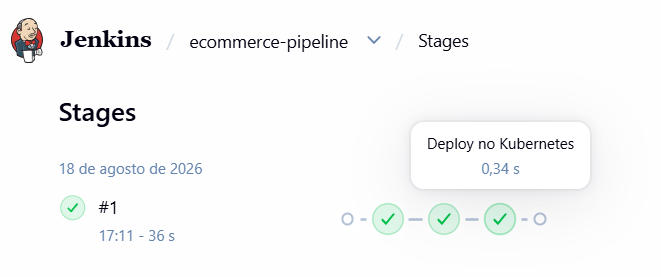
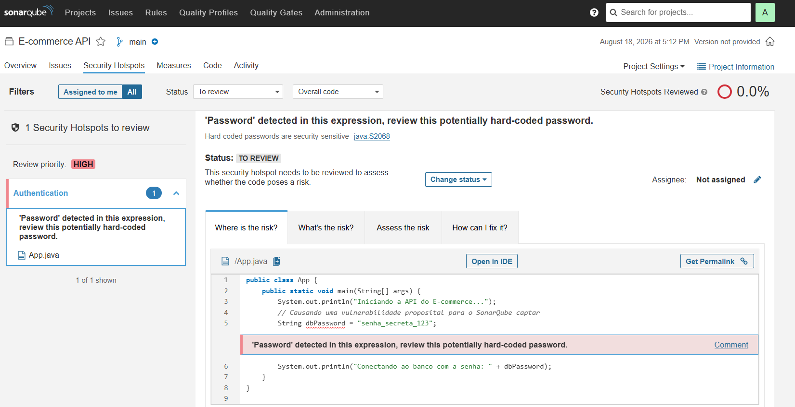
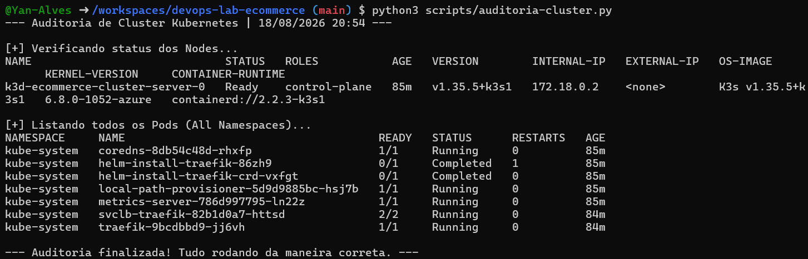

# Projeto de Automação e Segurança: Esteira CI/CD para E-commerce

Eu montei esse projeto para trabalhar com um funcionamento real de uma esteira de integração e entrega contínua (CI/CD). Usei o Jenkins para gerenciar todo o fluxo de automação e o SonarQube para atuar como um fiscal de qualidade. A minha ideia aqui foi simular os bastidores de um e-commerce, colocando uma API para rodar dentro de um cluster Kubernetes, mas priorizando a segurança. O processo é totalmente automatizado e quando um código novo é enviado, a própria estrutura escaneia, busca vulnerabilidades e só faz o deploy se estiver tudo certo, sem eu precisar intervir ou testar na mão.

### Meus Objetivos com o Projeto

*   **Segurança:** Eu configurei o ambiente para que o SonarQube barre automaticamente qualquer código que tenha senhas expostas ou falhas críticas antes mesmo de chegar perto da produção.
*   **Automação:** Eu tirei a necessidade de rodar comandos de deploy manualmente no terminal. Tudo é orquestrado de forma automática pela pipeline escrita no Jenkinsfile.
*   **Auditoria:** Criei um script próprio em Python que conversa diretamente com o Kubernetes para analisar e me dar um relatório garantindo que os servidores e os containers estão saudáveis.

### Ferramentas que usei

*   **Docker e Kubernetes:** Usei para empacotar a aplicação web de um jeito isolado e para orquestrar os servidores locais de forma escalável.
*   **Jenkins:** Usei para escrever e executar a pipeline (esteira CI/CD) como código, amarrando todas as etapas do processo.
*   **SonarQube:** A ferramenta utilizada para realizar a análise estática do código e garantir o bloqueio de vulnerabilidades.
*   **Python e Bash:** Utilizados para automatizar a extração de métricas e a auditoria de infraestrutura direto do terminal.

---

## Como a Arquitetura Funciona na Prática

Eu quis que o fluxo fosse 100% autônomo, e para isso, desenvolvi a esteira como código no meu arquivo `Jenkinsfile`. Na prática, quando um código novo sobe pro repositório (simulando uma  API fictícia em Java aqui nesse projeto), o Jenkins percebe a mudança e começa a agir.

### 1. A Automação pelo Jenkins
A primeira coisa que o Jenkins faz é ler as regras de deploy definidas. No caso, o que fiz foi configurar os tokens de acesso direto no cofre dele, assim ele consegue se comunicar com o SonarQube de um jeito totalmente seguro. Se a validação passar, o próprio Jenkins pega as credenciais criptografadas e manda a aplicação lá pro cluster Kubernetes rodar.

*Execução da pipeline com sucesso, passando por todas as etapas definidas no código.*

### 2. A Barreira do SonarQube
Para ter certeza de que a esteira iria segurar o código ruim, criei um arquivo de teste (`App.java`) e deixei uma senha aberta no meio do código de propósito. O SonarQube fez a varredura e identificou na hora. Ele travou o processo e provou que a ideia de barrar os problemas de segurança logo no início do desenvolvimento funciona de verdade.

*Painel do SonarQube pegando a falha de segurança que deixei no código Java.*

### 3. Checando a situação do cluster Kubernetes
Para não ter que ficar caçando logs manualmente, fiz um script em Python (`auditoria-cluster.py`). Ele usa a biblioteca `subprocess` para rodar os comandos do Kubernetes e me mostra um relatório direto no terminal, me confirmando se os servidores e os pods estão funcionando.

*A saída do meu script no terminal confirmando que os nodes e os containers estão Ok.*

---

## Desafios durante o desenvolvimento do projeto

*   **Permissão do Git:** Tive o erro 128 do Git (permissão negada). Para resolver isso, entrei nas configurações globais dentro do container do Jenkins e adicionei o `safe.directory` para o Git confiar na minha pasta de trabalho e deixar a esteira baixar o código.
*   **Travamento por Falta de Memória:** Quando tentei rodar o Jenkins, o SonarQube e um cluster Kubernetes de uma vez só, acabou travando tudo no início. A saída foi configurar limites de memória e CPU direto nos manifestos YAML e nas configurações dos containers.

---

## O que tem no Repositório

*   **`kubernetes/`**: Os manifestos YAML que criam a infra, já com os limites de recursos e as adições de Secrets.
*   **`scripts/`**: A pasta onde guardo meus códigos auxiliares, como o script de auditoria em Python.
*   **`assets/`**: Onde deixei salvos os prints mostrando a funcionabilidade do andamento do fluxo.
*   **`Jenkinsfile`**: Arquivo ditando os passos que o Jenkins deve seguir.
*   **`App.java`**: Meu código fictício com uma senha aberta que usei para que o SonarQube barrasse.
*   **`sonar-project.properties`**: O arquivo que aponta pro SonarScanner como ele deve ler o projeto.
